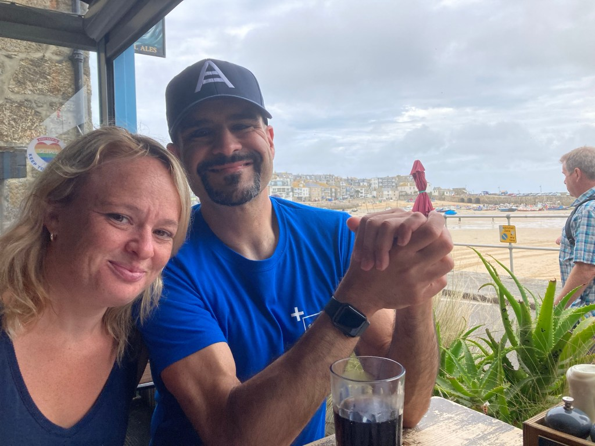

Hi, I'm Neil (the person on the right!). Thanks for visiting my blog!

I'm a Systems Engineer working for [Jamf](https://www.jamf.com/?v=1) (formerly [dataJAR](https://datajar.co.uk)) and I'm passionate about helping educational institutions and businesses succeed with Apple technology. This blog is a collection of my own thoughts and content and does not represent or reflect my employer.

Before that, my previous experience was in the UK higher education (university) sector. I worked at the [University of East London](https://www.uel.ac.uk/) for 15 years, where at the end of my career there I managed nearly 500 Apple Macs, 4,000 Windows PCs and lots of Android and iOS devices.

My background is in sound engineering for music and IT training; I'm an Apple Certified Trainer for Logic Pro; a music production platform. During my career I've been doing all these things, sometimes at the same time and not in any specific order.

If you want to know more about me professionally, please [visit my LinkedIn profile](https://www.linkedin.com/in/neilmartin83).

I love working with this stuff and maybe my experiences will give a little back to the community that has given me so much. I'm honoured to be [one of the administrators](https://github.com/macadminsdotorg/slack-assets/blob/master/Admins.md) on the fantastic [MacAdmins Slack](https://www.macadmins.org/) community. I also have the privilege of working with some fantastic people to herd organise meet-ups under the banner of [London Apple Admins](http://www.londonappleadmins.org.uk/).

I used to ride a motorcycle and [cut my blogging teeth writing all sorts of things about it](https://cbf125rider.wordpress.com/). Unexpected by me, that particular blog got rather popular!
